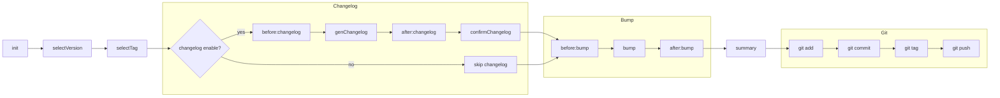

# Introduction

releaseasy is a lightweight release orchestration tool for npm packages. It completes version and Git tag management locally and pushes them to the remote repository, while the subsequent build and release process is automatically handled by CI/CD.

## Why develop releaseasy?

When maintaining multiple npm packages, the release process usually involves a lot of repetitive manual operations:

- Modify the version number in package.json
- Update CHANGELOG.md
- Check the Git working tree
- Commit version changes
- Create a Git tag
- Push the tag
- Wait for CI/CD to build and publish the npm package

Doing this for a single project is not complicated, but when you need to maintain multiple npm packages, repeating the same steps for every release is not only tedious but also prone to errors caused by missing a step.

Therefore, I wanted to standardize and automate these stable, repetitive, and error-prone release steps.

This is releaseasy.

## Flowchart

The following flowchart provides a more intuitive understanding of releaseasy's complete execution flow:

## Who's Using It

The following projects are using releaseasy (PRs to add your project are welcome):

- adminlts
