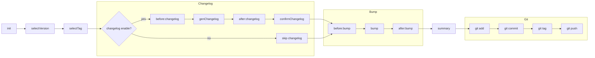

# 什么是 releaseasy?

releaseasy 是一个面向 npm 包的轻量级发布编排工具，在本地完成版本与 Git Tag 管理并推送至远程仓库，后续构建与发布流程交由 CI/CD 自动完成。

## 为什么开发 releaseasy？

在维护多个 npm 包时，发布流程通常存在大量重复的手动操作：

- 修改 package.json 版本号
- 更新 CHANGELOG.md
- 检查 Git 工作区
- 提交版本变更
- 创建 Git Tag
- 推送 Tag
- 等待 CI/CD 构建并发布 npm 包

单个项目这样做并不复杂，但当你需要维护多个 npm 包时，每次发布都重复执行相同的步骤，不仅繁琐，也容易因为遗漏某一步而产生错误。

因此，我希望把这些稳定、重复且容易出错的发布步骤标准化并自动化。

这就是 releaseasy。

## 流程图

通过下面的流程图，可以更直观地了解 releaseasy 的完整执行流程：

## 谁在用

以下项目正在使用 releaseasy（欢迎提交 PR 添加你的项目）：

- adminlts
